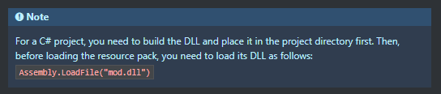

# Patch preloading - Godot Mono

Tested in Godot Mono version 3.5.2

## Explanation

Patching and modding your games made in the Godot engine is made super simple by the use of .pck-files. You can create new content, export it as a .pck.file and load it at runtime to access all of your new content as described in the official docs: https://docs.godotengine.org/en/3.5/tutorials/export/exporting_pcks.html

This works very well in the standard release of Godot using only GD-scripts, however, things become a little more complicated when using the Mono version of Godot. To be able to load new C#-scripts at runtime, you will also need the assemblies associated with the .pck-file to be loaded at runtime aswell. According to the docs, this is achieved by simply calling:

    Assembly.LoadFile("[filename].dll");

before loading in the .pck-file, as described here:

Even though this does load the DLL, the C#-scripts inside the new .pck-file can still NOT be accessed and when loading in scenes from the new .pck-file, they load in with the either old versions of the scripts or none at all and throws an error.

To solve this issue, I made a simple preload project that can be used to find the correct scripts from the new assemblies and load them into the associated scenes/nodes at runtime.

## How to use

- Export the patch/mod as .pck-file
- Find the .dll-file of the patch/mod in:

        .mono\temp\bin\Release
        or:
        .mono\temp\bin\Debug

    or export the patch/mod as .zip and find the .dll in:

        .mono\assemblies\Release
        or:
        .mono\assemblies\Release

- Place the .pck-file and .dll-file in:

        Preload/patch
        or:
        Preload/builds/patch

    depending on if you are running the game from the player/editor or the exported build.

- Run the game and it should load in the new content on start.

## Note

- Make sure that the "patchDirectory" string in AssemblyResolver.cs matches your patch folder's name.

- Make sure that the "mainScenePath" string in Preload.cs matches the path to to the mainScene in your patch.

- The patch/mod should ideally be created in a separate project, otherwise there might be some assembly conflicts because of the way Godot handles assemblies.

- This project is pretty simple and only loads one scene with the associated scripts from the .pck-resource on startup. This can of course be expanded on for more functionality based on specific needs.

- Also, please note that loading in external .dlls at runtime can have some serious security risks if done improperly. 